# Game Pasa
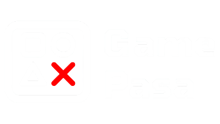 
Game Pasa is a student-built gaming platform inspired by modern game storefronts.  
The project was developed as college coursework to improve practical skills in web development, team collaboration, and problem-solving.

## Table of Contents

- [Introduction](#introduction)
- [Project Goal](#project-goal)
- [Project Status](#project-status)
- [Platform Pages](#platform-pages)
- [Technology Stack](#technology-stack)
- [Testing](#testing)
- [Domain & Registration](#domain--registration)
- [Conclusion](#conclusion)
- [Media Showcase](#media-showcase)

## Introduction

Game Pasa (where *pasa* means "friend" in Newari) is designed to help users browse, discover, and download games through a clean and beginner-friendly web interface.

This project reflects our work in:
- HTML structure and page design
- CSS styling and theming
- JavaScript interactions and logic
- team collaboration under deadline constraints

## Project Goal

Our key objectives were:
- strengthen understanding of HTML, CSS, and JavaScript through a real project
- build a user-friendly and visually clean website
- solve practical issues such as login flow and dark/light mode behavior
- improve teamwork by splitting responsibilities and sharing ideas
- improve time management while balancing academic work
- break complex tasks (such as login logging) into manageable steps
- gain confidence by completing a complete product in a short timeline

## Project Status

| Project Item | Status   | Related Files/Links | Notes |
|---|---|---|---|
| Website | Launched | `GamePasa.com.np` | Hosted |
| Documentation | Launched | This README | Completed |
| Source Code | Launched | Repository files | ZIP shared separately |
| Login Logs | Launched | [GAME PASA USERS](https://docs.google.com/spreadsheets/d/1jhjczr0zQAqXaa-nNR4Gd23VmWhAlKxREr5lQ0qJ9HE/edit?usp=sharing) (Google Sheets) | Stores login history with timestamp |

## Platform Pages

- **Home**: Landing page with a strong intro and call-to-action.
- **Library**: Displays user game collection and recently played items.
- **Store**: Lists available games for purchase/download.
- **Community**: Highlights user community and Discord engagement.
- **About Us**: Introduces developers, purpose, and future plan.
- **Sign-Up / Login**: Handles user authentication and account-based tracking.

## Technology Stack

- **HTML** for structure
- **CSS** for styling and responsive layout
- **JavaScript** for interactivity (theme switch, login behavior, dynamic features)
- **Visual Studio Code** as development environment
- **Google Sheets integration** for login log tracking

## Testing

Testing was demonstrated in **GAMEPASA SHOWCASE.mp4**, covering:
- dark/light theme switching
- login and logout flow
- game browsing and selection
- overall navigation and usability

## Domain & Registration

The platform was registered and deployed under:

- **GamePasa.com.np**

## Conclusion

Building Game Pasa was a strong learning experience in both technical and teamwork skills.  
Despite time constraints and challenges (including exam schedules and debugging CSS/JavaScript issues), we successfully delivered a functional project with meaningful features such as login tracking and theme switching.

This project helped us:
- improve coding fundamentals
- collaborate effectively under pressure
- use learning resources (tutorials, documentation, and AI tools) productively
- build confidence for future real-world development work

## Media Showcase

> Add your screenshots/GIFs exported from Google Docs into a folder like `assets/` and update the links below.

### Wireframe

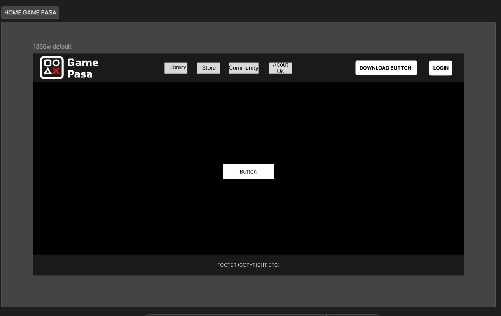
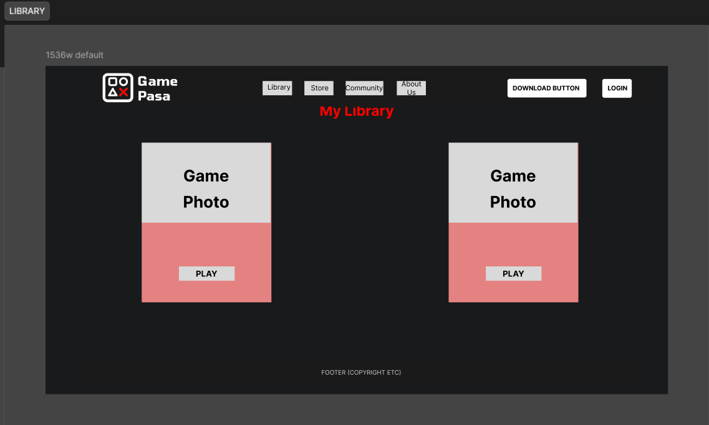
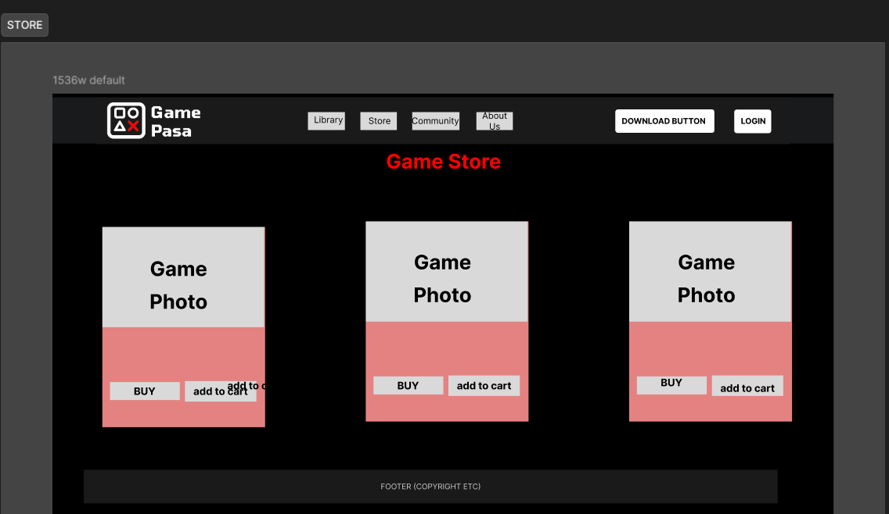
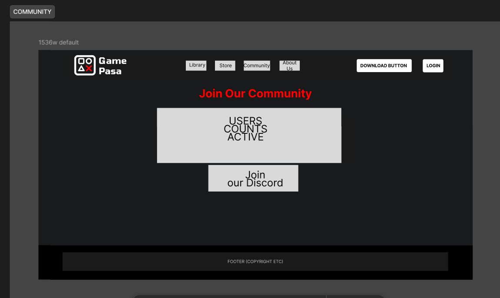
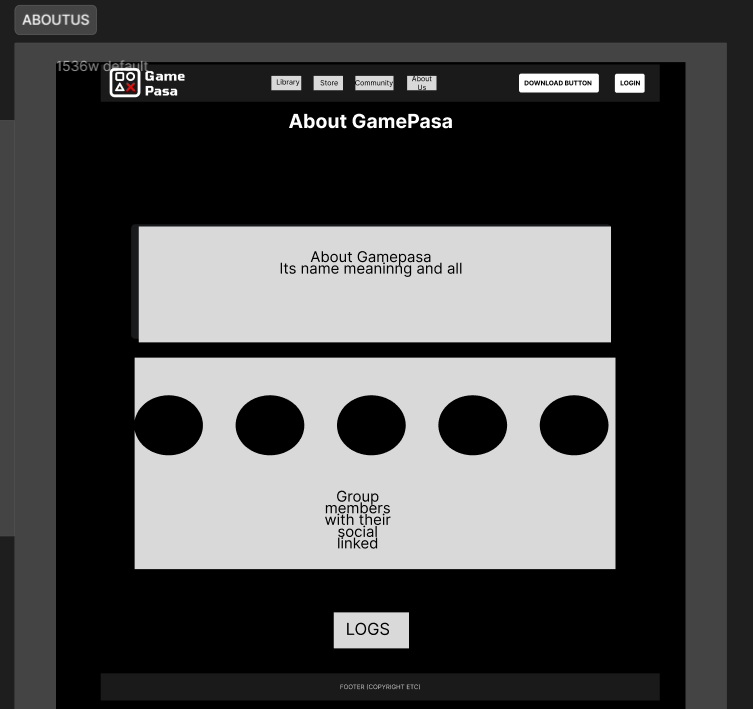

### UI Screenshots / GIFs

Home Page
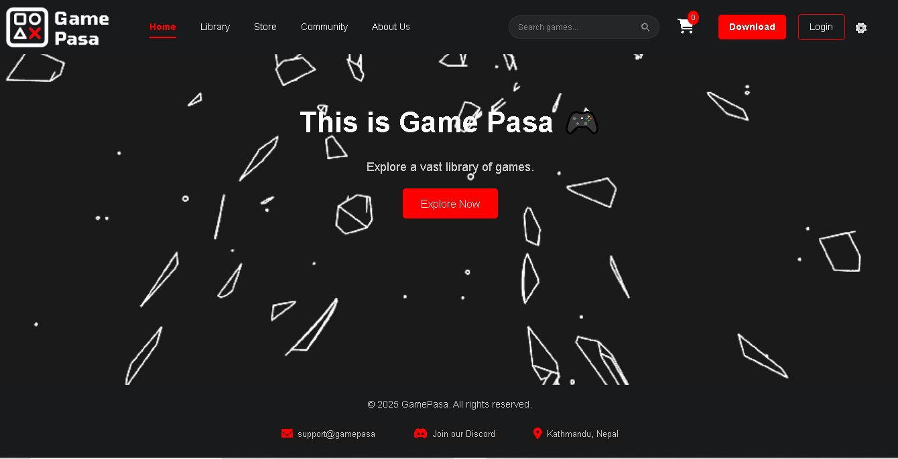
Library
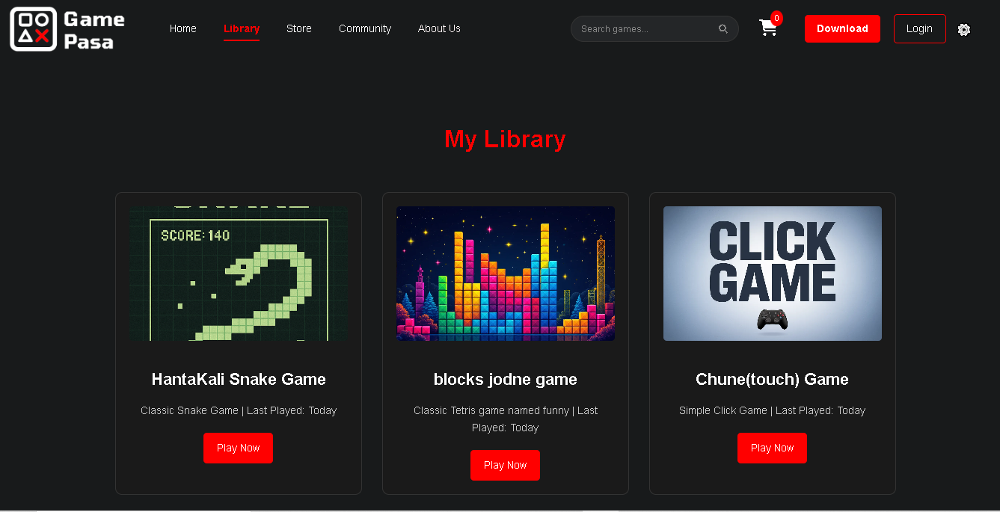
Store
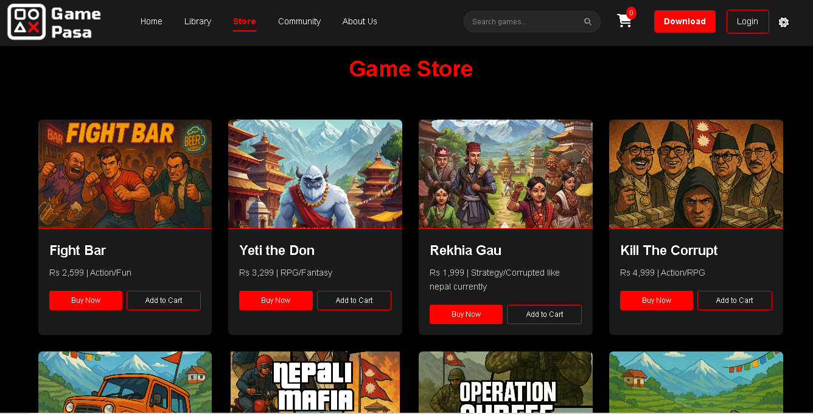 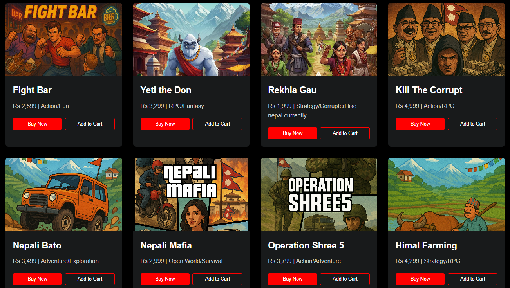
Community
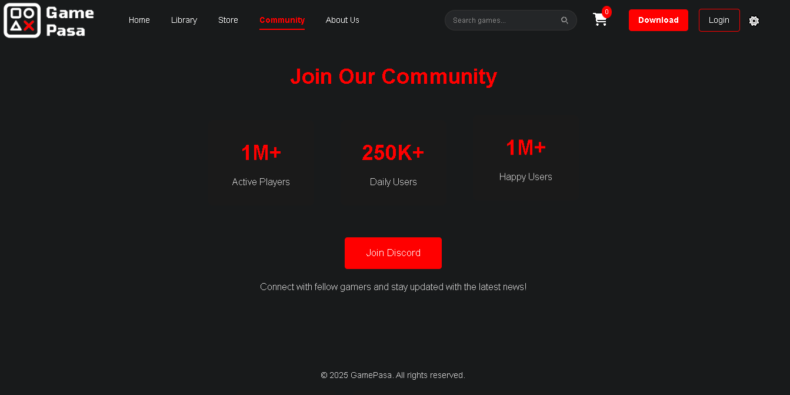
About Us
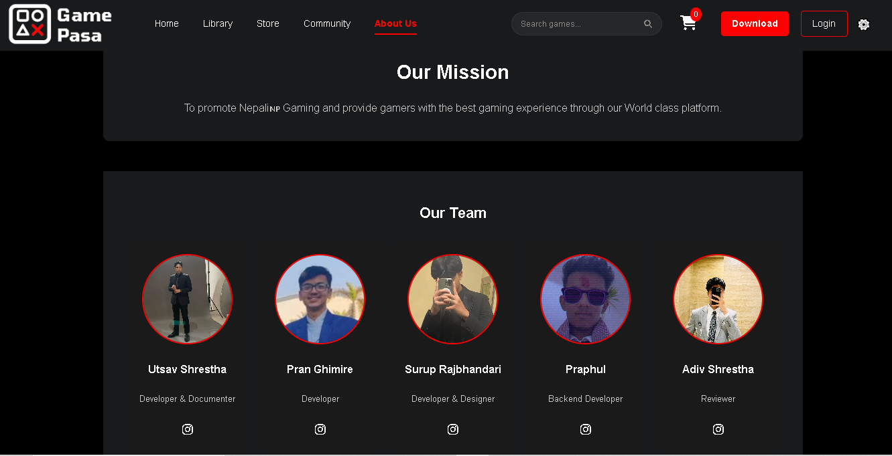
Login
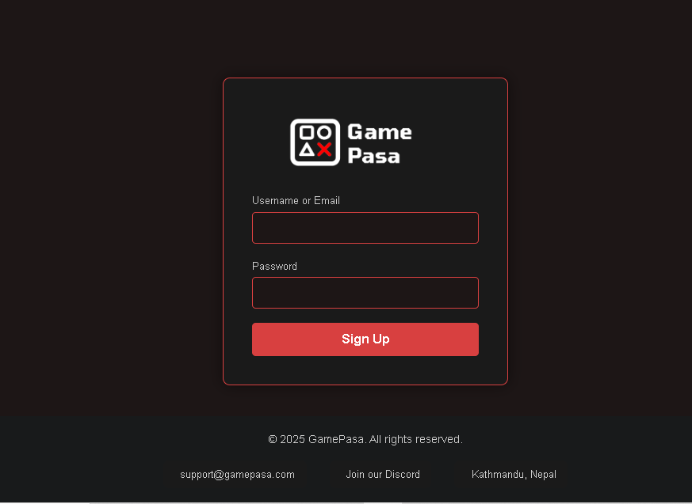

### Demo Video
Hosted via AWS

`(add or link GAMEPASA SHOWCASE.mp4 here)`
